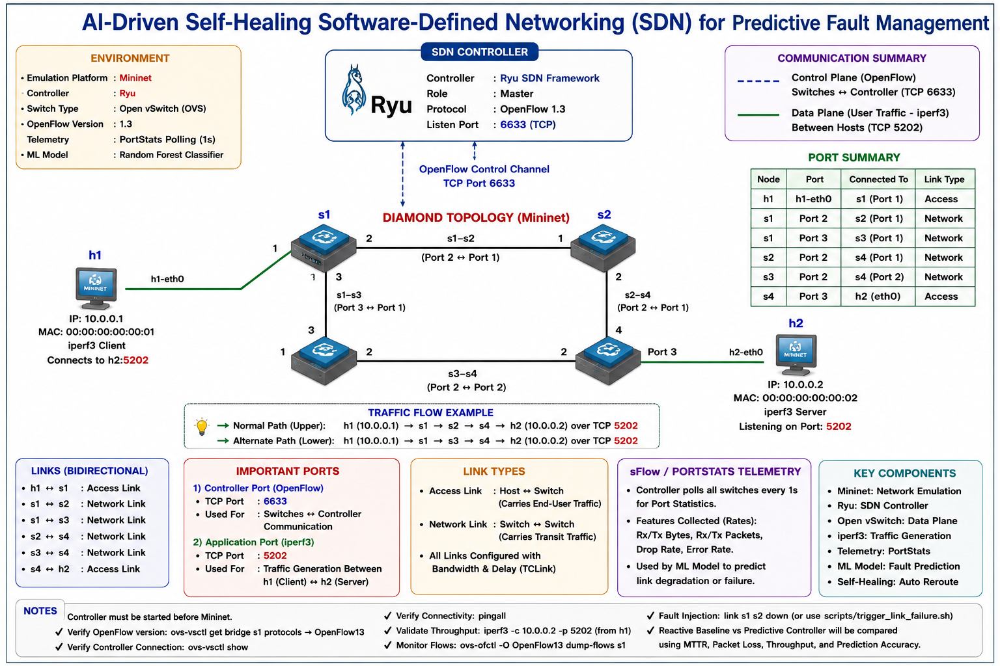

# AI-Driven Self-Healing SDN for Predictive Fault Management

This project implements a predictive self-healing Software-Defined Networking system using Mininet, Ryu, OpenFlow 1.3, and machine learning.

## Project Aim

The aim is to design and evaluate a self-healing SDN system that uses telemetry-driven machine learning to predict network faults and trigger proactive rerouting before major service disruption occurs.

## Technology Stack

- Mininet for network emulation
- Open vSwitch for OpenFlow switching
- Ryu as the SDN controller
- OpenFlow 1.3 for controller-switch communication
- Scikit-learn for machine learning
- iperf3 for traffic generation and throughput measurement
- Python and Bash scripts for automation and evaluation

## Topology Images

### Diamond SDN Topology


### Predictive Self-Healing SDN Workflow




## Project Structure

```text
sdn-selfhealing/
├── topo/
├── ryu_apps/
├── scripts/
├── data/
│   ├── raw/
│   └── processed/
├── models/
├── results/
├── README.md
└── requirements.txt


## Public Repository Notice

This repository contains a cleaned portfolio version of my MSc project implementation. Large experiment outputs, trained model files, raw telemetry datasets, and university submission>


