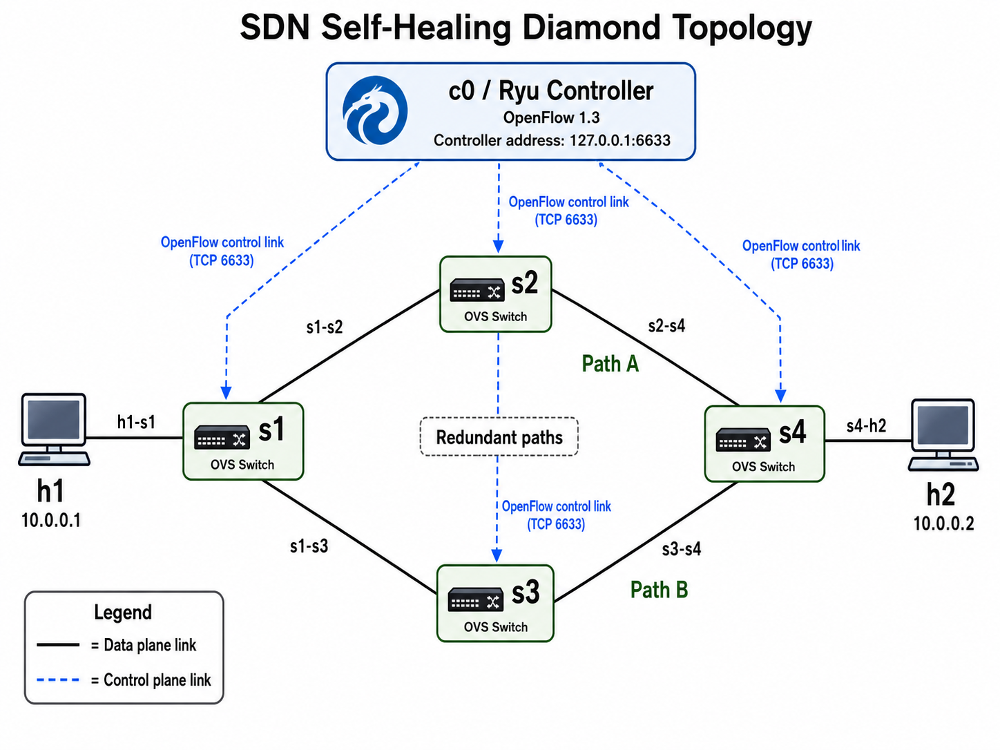

# AI-Driven Self-Healing SDN for Predictive Fault Management

> A cleaned public portfolio version of my MSc project: **AI-Driven Self-Healing Software-Defined Networking (SDN) for Predictive Fault Management**.

This project implements a predictive self-healing SDN system using **Mininet**, **Open vSwitch**, **Ryu**, **OpenFlow 1.3**, and **machine learning**.  
The system monitors network telemetry, predicts fault-risk conditions, and triggers proactive rerouting before major service disruption occurs.

---

## Project Aim

The aim of this project is to design, implement, and evaluate a self-healing SDN system that uses telemetry-driven machine learning to predict network faults and automatically apply corrective actions such as rerouting traffic through a healthier path.

The project focuses on reducing:

- Mean Time To Recovery (MTTR)
- Packet loss
- Throughput disruption
- Manual intervention in fault recovery

---

## Research Context

Traditional SDN fault management is usually reactive: the controller detects a fault only after it occurs, recomputes a path, and installs new forwarding rules.

This project extends that approach by integrating machine learning into the SDN controller so that abnormal network conditions can be detected earlier.

The system was tested using a redundant diamond topology where traffic can move through an alternative path when one link becomes faulty or degraded.

---

## Technology Stack

| Technology | Purpose |
|---|---|
| **Mininet** | Network emulation |
| **Open vSwitch** | OpenFlow switching |
| **Ryu** | SDN controller |
| **OpenFlow 1.3** | Controller-switch communication |
| **Scikit-learn** | Machine learning |
| **iperf3** | Traffic generation and throughput measurement |
| **Python** | Controller logic and ML scripts |
| **Bash** | Automation and experiment support |

---

## Project Structure

```text
sdn-selfhealing/
├── topo/
│   └── diamond_topo.py
├── ryu_apps/
│   ├── l2_learning.py
│   ├── path_forwarding.py
│   ├── path_forwarding_telemetry.py
│   └── reactive_fault_baseline.py
├── scripts/
│   ├── start_iperf_client.sh
│   ├── trigger_link_failure.sh
│   └── parse_iperf_recovery.py
├── docs/
│   └── images/
│       ├── topology_diamond.png
│       └── topology_predictive_flow.png
├── data/
│   ├── raw/
│   │   └── README.md
│   └── processed/
│       └── README.md
├── models/
│   └── README.md
├── results/
│   └── README.md
├── README.md
├── requirements.txt
└── .gitignore
```

---

## Diamond Topology Image



---

## Main Components

### 1. Diamond Topology

The project uses a redundant diamond topology with two hosts and four Open vSwitch switches. The topology provides two paths between the source and destination hosts:

```text
Upper path: h1 → s1 → s2 → s4 → h2
Lower path: h1 → s1 → s3 → s4 → h2
```

This redundancy allows traffic to be rerouted when one path fails or becomes degraded.

---

### 2. L2 Learning Controller

The L2 learning controller provides basic MAC learning and forwarding behaviour. It learns source MAC addresses, forwards known destination traffic, and floods ARP traffic when required.

---

### 3. Path-Based Forwarding Controller

The path-based forwarding controller uses Ryu topology discovery to build an adjacency graph of the network. It computes paths between edge switches and installs OpenFlow rules along the selected route.

---

### 4. Reactive Fault Baseline

The reactive baseline detects link or port failures after they occur. It then rebuilds the topology graph, recomputes the shortest path, deletes old flow rules, and installs new rules along the recovery path.

---

### 5. Telemetry Collection

The telemetry controller collects OpenFlow PortStats from switches and converts cumulative counters into rate-based features such as:

- Receive byte rate
- Transmit byte rate
- Packet rate
- Drop rate
- Error rate

These telemetry features are used to support machine-learning-based fault prediction.

---

### 6. Predictive Self-Healing Concept

The predictive self-healing approach uses telemetry-driven machine learning to identify risky network conditions before complete failure.

When the risk score crosses the configured threshold, the controller can proactively reroute traffic to a healthier path.

---

## Example Run Commands

### 1. Start the Reactive Fault Baseline Controller

```bash
cd ~/sdn-selfhealing
source ~/venvs/ryu/bin/activate

MODEL_PATH=~/sdn-selfhealing/models/fault_prediction_model.pkl \
RISK_THRESHOLD=0.10 \
RISK_CONSECUTIVE_POLLS=2 \
HEALING_COOLDOWN_SEC=20 \
POST_HEAL_CHECK_SEC=8 \
ryu-manager --observe-links --ofp-tcp-listen-port 6633 \
ryu.topology.switches \
ryu_apps/predictive_self_healing_controller.py \
2>&1 | tee results/phase8_ryu.log
```

---

### 2. Start the Mininet Diamond Topology

Open a second terminal:

```bash
cd ~/sdn-selfhealing
sudo python3 topo/diamond_topo.py
```

---

### 3. Start Traffic in Mininet 

Inside the `mininet>` prompt:

```bash
pingall

h2 iperf3 -s -i 1 &
h2 iperf3 -s -p 5202 -i 1 &

h1 bash scripts/start_iperf_client.sh 10.0.0.2 45 results/phase8_congestion_iperf.txt results/phase8_congestion_iperf_start.txt &
```

---

### 4. Inject the Congestion in Mininet 

```bash
h1 iperf3 -c 10.0.0.2 -p 5202 -P 16 -t 25 -i 1 &
```

---

### 5. Results

Open a third terminal:

```bash
cd ~/sdn-selfhealing
grep -Ei "PREDICTION_ALERT|HEALING_ACTION|POST_HEAL_CHECK|risk|heal|reroute|avoid" results/phase8_ryu.log
```

---

## Evaluation Metrics

The project evaluates both network behaviour and machine-learning performance using:

| Network Metrics | Machine Learning Metrics |
|---|---|
| Mean Time To Recovery (MTTR) | Accuracy |
| Packet loss | Precision |
| Throughput | Recall |
| Controller reaction time | F1-score |
|  | ROC-AUC |
|  | Confusion matrix |

---

## Public Repository Notice

This repository contains a cleaned portfolio version of my MSc project implementation.

Large experiment outputs, trained model files, raw telemetry datasets, processed datasets, university submission documents, 
and private evaluation artefacts are excluded from this public repository for privacy, storage, and academic integrity reasons.

The full private version contains the complete experimental artefacts, datasets, trained model, logs, screenshots, and evaluation outputs.

---

## Excluded from Public Version

The following files are intentionally excluded from the public repository:

```text
data/raw/*.csv
data/processed/*.csv
models/*.pkl
results/*.log
results/*.txt
results/*.csv
*.docx
*.pdf
*.zip
__pycache__/
*.pyc
venv/
```

---

## Author

**Ajay Gurrapu**
